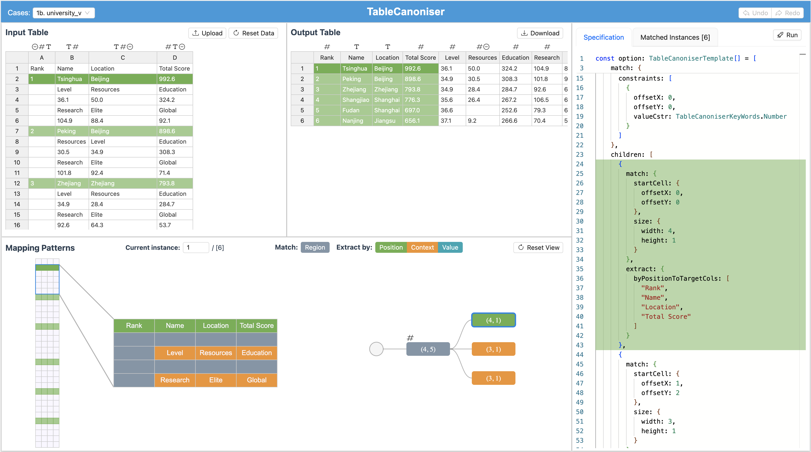

# TableCanoniser

[](https://opensource.org/licenses/MIT)
[](https://www.typescriptlang.org/)
[](https://vuejs.org/)
[](https://handsontable.com/)
[](https://microsoft.github.io/monaco-editor/)
[](https://d3js.org/)
[](https://github.com/TableCanoniser/TableCanoniser.github.io/releases/tag/1.0.0)

TableCanoniser is an interactive visualization system designed to help transform messy data (non-aligned tables) into canonical/tidy tables (axis-aligned tables).

It is implemented using [Vue.js 3.0](https://vuejs.org/) as the frontend framework, with [Handsontable](https://handsontable.com/) for table rendering, [Monaco Editor](https://microsoft.github.io/monaco-editor/) for code display, and [D3.js](https://d3js.org/) for visualization.
This system is entirely frontend-based, eliminating the need for user-side deployment.
It can be accessed directly through a web browser ([TableCanoniser URL](https://tablecanoniser.github.io/)).
We expect that the ease of access and the rich visualization and interaction features of TableCanoniser can significantly enhance the efficiency of table transformation for users, while also fostering greater trust in the results.

Our declarative grammar, [_table-canoniser_](https://www.npmjs.com/package/table-canoniser) (which has been built and published as an open-source NPM package), is defined in [`src/table-canoniser/`](https://github.com/TableCanoniser/TableCanoniser.github.io/tree/deploy/src/table-canoniser)

## System Interface



## Project setup

### Install dependencies

```
npm install
```

- use `node --version` to check current node version, we expect it to be **19.5.0**. To install multiple version of node, we recommend using [nvm](https://github.com/nvm-sh/nvm).

### Compiles and hot-reloads for development

```
npm run serve
```

Now the project is running on [localhost](http://localhost:8080/).

### Compiles and minifies for production

```
npm run build
```

## Citation

If extending or using our work, please cite our corresponding paper found in the [DOI](https://doi.org/10.1145/3706598.3714321). The BibTex is as follows.

```
@inproceedings{10.1145/3706598.3714321,
  author = {Xiong, Kai and Huang, Cynthia A. and Wybrow, Michael and Wu, Yingcai},
  title = {TableCanoniser: Interactive Grammar-Powered Transformation of Messy, Non-Relational Tables to Canonical Tables},
  year = {2025},
  booktitle = {Proceedings of the CHI Conference on Human Factors in Computing Systems},
  abstract = {TableCanoniser is a declarative grammar and interactive system for constructing relational tables from messy tabular inputs such as spreadsheets. We propose the concept of axis alignment to categorise input types and characterise the expanded scope of our system relative to existing tools. The declarative grammar consists of match conditions, which specify repeating patterns of input cells, and extract operations, which specify how matched values map to the output table. In the interactive interface, users can specify match and extract patterns by interacting with an input table, or author more advanced specifications in the coding panel. To refine and verify specifications, users interact with grammar-based provenance visualisations such as linked highlighting of input and output values, tree-based visualisation of matching patterns, and a mini-map overview of matched instances of patterns with annotations showing where cells are extracted to. We motivate and illustrate our work with real-world usage scenarios and workflows.},
  keywords = {data transformation, data provenance, table canonicalisation, table understanding, declarative grammar, interactive visualisation},
  url = {https://doi.org/10.1145/3706598.3714321},
  doi = {10.1145/3706598.3714321}
}
```
