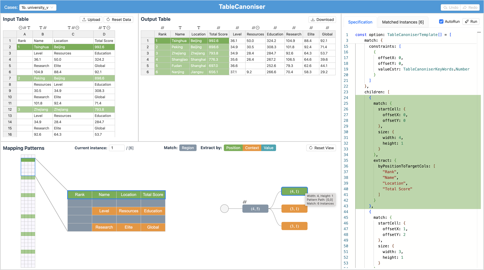

# TableCanoniser

TableCanoniser is an interactive visualization system designed to help transform messy data (non-aligned tables) into canonical/tidy tables (axis-aligned tables).

It is implemented using [Vue.js 3.0](https://vuejs.org/) as the frontend framework, with [Handsontable](https://handsontable.com/) for table rendering, [Monaco Editor](https://microsoft.github.io/monaco-editor/) for code display, and [D3.js](https://d3js.org/) for visualization.
This system is entirely frontend-based, eliminating the need for user-side deployment.
It can be accessed directly through a web browser ([TableCanoniser URL](https://xkkevin.github.io/TableCanoniser/)).
We expect that the ease of access and the rich visualization and interaction features of TableCanoniser can significantly enhance the efficiency of table transformation for users, while also fostering greater trust in the results.

Our declarative grammar, [_table-canoniser_](https://www.npmjs.com/package/table-canoniser) (which has been built and published as an open-source NPM package), is defined in [`src/table-canoniser/`](https://github.com/xkKevin/TableCanoniser/tree/dev/src/table-canoniser)

## System Interface



## Project setup

### Install dependencies

```
npm install
```

- use `node --version` to check current node version, we expect it to be **19.5.0**. To install multiple version of node, we recommend using [nvm](https://github.com/nvm-sh/nvm).

### Compiles and hot-reloads for development

```
npm run serve
```

Now the project is running on [http://localhost:8080/TableCanoniser/](http://localhost:8080/TableCanoniser/).

### Compiles and minifies for production

```
npm run build
```
